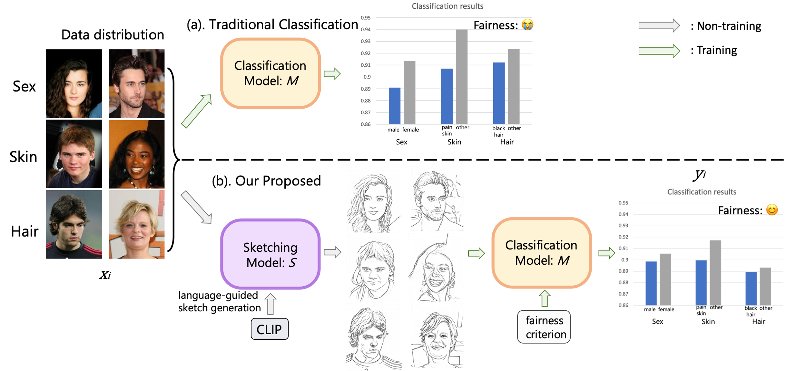
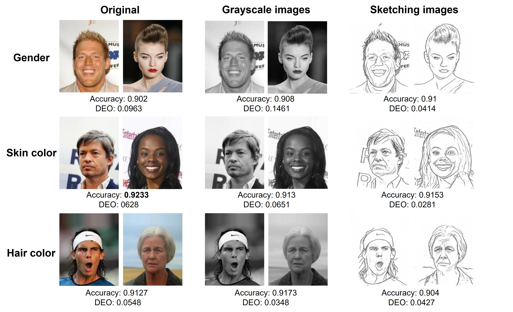

# Improving-Fairness-in-Image-Classification-via-Sketching
The Pytorch Implementation of NeurIPS workshop paper "[Improving Fairness in Image Classification via Sketching](https://arxiv.org/abs/2211.00168)".

[Ruichen Yao](https://scholar.google.com/citations?user=_ffV15wAAAAJ&hl=en&oi=ao), [Ziteng Cui](https://cuiziteng.github.io/), [Xiaoxiao Li](https://xxlya.github.io/xiaoxiao/), [Lin Gu](https://sites.google.com/view/linguedu/home)

[[Paper](https://arxiv.org/pdf/2211.00168.pd)] [[Video](https://neurips.cc/virtual/2022/workshop/49959#wse-detail-61542)]

## Overall Pipeline


An overview of our method has been shown in the Figure above. Based on standard vision classification paradigm, our pipeline mainly involves two modifications. First, we convert the input images into their sketches and feed them to the following classification model for prediction. Towards further fairness improvement, in the second step we introduce a fairness loss function to mitigate the bias in the model.

## Sketching Method

For sketch generation model $S$, we employ the latest image-to-sketching method ([Informative Drawings: Learning to generate line drawings that convey geometry and semantics](https://arxiv.org/abs/2203.12691)) to convert input image $x_i$ into its corresponding sketch $S(x_i)$.

The code are available [here](https://github.com/carolineec/informative-drawings). Sketching images should be stored at `./face_image_classification(CelebA)/dataset/sketch_celeba/`(CelebA dataset) and `./skin_cancer_classification(ISIC)/data/sketch/`(ISIC dataset).

## Usage

### CelebA
#### Setup

Run the `./face_image_classification(CelebA)/requirements.txt` with the following command to meet requirements.
```
pip install -r requirements.txt
```

The CelebA dataset can be downloaded [here](https://mmlab.ie.cuhk.edu.hk/projects/CelebA.html). The images should be stored at `./face_image_classification(CelebA)/dataset/img_align_celeba/`

Run `./face_image_classification(CelebA)/train_test_split.py` with the following command:
```
py train_test_split.py --img_type xxx --sensitive_type xxx --num xxx
```
You could adjust `--csv_dir`, `--data_dir`, `--img_dir`, `--img_type`, `--sensitive_type`, and `--num` in this file.

Run `./face_image_classification(CelebA)/Grey.py` with the following command could generate grey scale images after train test split.
```
py Grey.py --sensitive_type xxx
```
You could adjust `--sensitive_type` in this file.


#### Pretained model
The pretained model can be downloaded at [here](https://drive.google.com/file/d/1z6suPVTeVDL0ui7UVpchePRbjMTDpSU0/view?usp=sharing).

The structure of the `./face_image_classification(CelebA)/dataset/` folder should be looked like this after preprocessing.


#### Testing
The test results are available at `./face_image_classification(CelebA)/Tesing_results_of_CelebA.ipynb`. You could directly view and run the test results using the existing model.

In addition, you could run `./face_image_classification(CelebA)/train_resnet.py` with the following command to test the model.
```
py train_resnet.py --isTrain 0 --target xxx --img_type xxx --sensitive_type xxx --fairloss x
```
You could adjust `--target`, `--img_type`, `--sensitive_type`, and `--fairloss` in this file when testing the model.


#### Training
To train the model, you could run `./face_image_classification(CelebA)/train_resnet.py` with the following command:
```
py train_resnet.py --target xxx --img_type xxx --sensitive_type xxx --fairloss x --batch_size x --max_epochs_stop x --num_epochs x --learning_rate x
```
You could adjust `--target`, `--img_type`, `--sensitive_type`, `--batch_size`, `--max_epochs_stop`, `--num_epochs`, `--fairloss`, and `--learning_rate` in this file when training the model.

### Skin ISIC 2018

#### Setup

Run the `./skin_cancer_classification(ISIC)/requirements.txt` with the following command to meet requirements.
```
pip install -r requirements.txt
```
The Skin ISIC 2018 dataset can be downloaded [here](https://challenge.isic-archive.com/data/#2018). The images should be stored at `./skin_cancer_classification(ISIC)/data/origin/`.

#### Pretained model
The pretained model can be downloaded at [here](https://drive.google.com/file/d/1TamMyz31fAV4T7zLoeHiLCG1kfz1zYk-/view?usp=sharing). The `saved_model` folder should be placed at `./saved_model/`.


#### Testing
You could run `./skin_cancer_classification(ISIC)/train_vgg.py` with the following command to test the model.
```
py train_vgg.py --schema test --img_type xxx --privilege_type xxx --fairloss x --model_name xxx.pt
```
You could adjust `--img_type`, `--privilege_type`, `--fairloss`, and `--model_name` in this file when testing the model.

#### Training
To train the model, you could run `./skin_cancer_classification(ISIC)/train_vgg.py` with the following command:
```
py train_vgg.py --schema train --img_type xxx --privilege_type xxx --fairloss x --batch_size x --epochs x
```
You could adjust `--img_type`, `--privilege_type`, `--batch_size`, `--epochs`, and `--fairloss` in this file when training the model.


## Evaluation Results


## Citation
If you find this work helpful, feel free to cite our paper as follows:

```
@inproceedings{
yao2022improving,
title={Improving Fairness in Image Classification via Sketching},
author={Ruichen Yao and Ziteng Cui and Xiaoxiao Li and Lin Gu},
booktitle={Workshop on Trustworthy and Socially Responsible Machine Learning, NeurIPS 2022},
year={2022},
url={https://openreview.net/forum?id=Rq2vt3tnAK9}
}
```

## Acknowledgements
Sketching model adapted from [Informative Drawings: Learning to generate line drawings that convey geometry and semantics](https://arxiv.org/abs/2203.12691). [[code](https://github.com/carolineec/informative-drawings)]

VGG model adapted from [Estimating and Improving Fairness with Adversarial Learning](https://arxiv.org/abs/2103.04243).
